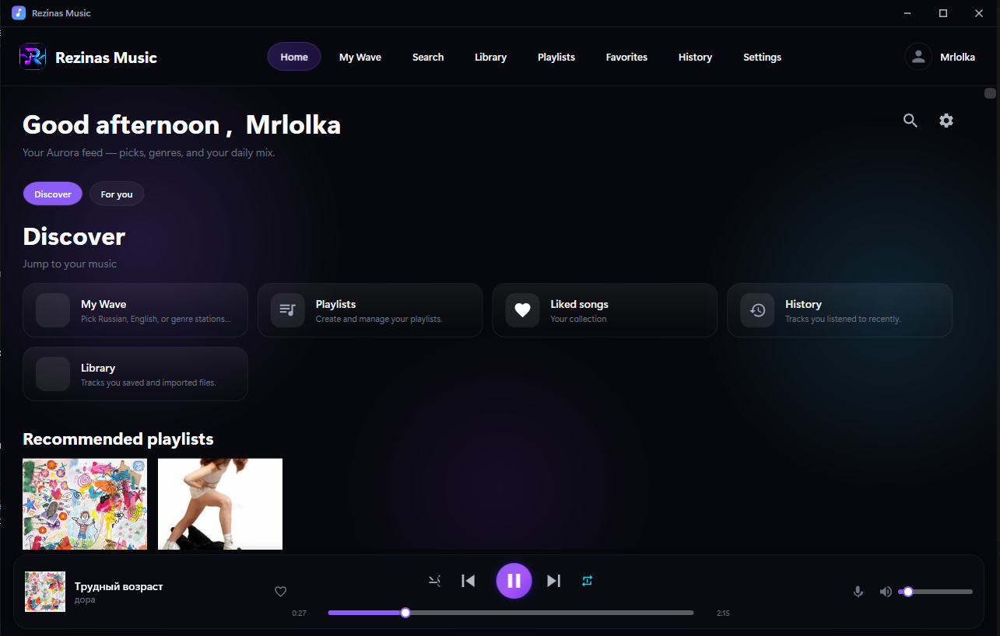
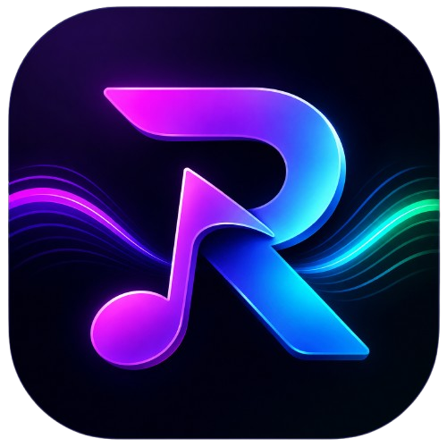

# Rezinas Music





Desktop music player for Windows (.NET 8 / WPF): search, playlists, favorites, radio «My Wave», lyrics, and a bottom player bar.

**Repository:** [github.com/lolka213d/Rezinas-Music](https://github.com/lolka213d/Rezinas-Music)

## Requirements

- Windows 10/11 (x64)
- [.NET 8 SDK](https://dotnet.microsoft.com/download/dotnet/8.0) — only for building from source

## Run from source

```powershell
dotnet run --project src/Harmony/Harmony.csproj
```

## Build standalone `.exe`

```powershell
dotnet publish src/Harmony/Harmony.csproj -c Release -r win-x64 --self-contained true `
  -p:PublishSingleFile=true -o publish/win-x64
```

Output: `publish/win-x64/RezinasMusic.exe` — no separate .NET install needed.

## Build Windows installer

Requires [Inno Setup 6](https://jrsoftware.org/isinfo.php) (script can install it via winget).

```powershell
.\installer\build-installer.ps1
```

Output: `publish/RezinasMusic-Setup-1.0.0.exe`

The installer lets you choose install folder and app language (default: English).

## User data (not in the repo)

Playlists, username, favorites, and settings are stored per user on each PC:

`%LOCALAPPDATA%\RezinasMusic\harmony.db`

The installer and published `.exe` do **not** include your personal library.

## Project layout

```
program/
├── Harmony.sln
├── docs/screenshots/     # README images
├── src/Harmony/          # WPF app
├── installer/            # Inno Setup script
└── tests/
```

## License

This project is licensed under the [MIT License](LICENSE).

## Privacy & data

- **Local first:** playlists, favorites, history, and settings live in `%LOCALAPPDATA%\RezinasMusic\harmony.db` on your PC.
- **API keys:** optional keys (YouTube, Spotify, SoundCloud, Last.fm) are stored locally in your settings — they are never committed to the public repository.
- **Network:** the app calls Deezer (charts/search), LRCLIB/lyrics.ovh (lyrics), and optionally YouTube/Spotify/SoundCloud when you configure keys. Last.fm scrobbling only runs if you enable it.
- **Updates:** optional check against [GitHub Releases](https://github.com/lolka213d/Rezinas-Music/releases) — no telemetry or analytics backend.
- **Discord status:** only sent when you enable it in Settings and Discord is running.
